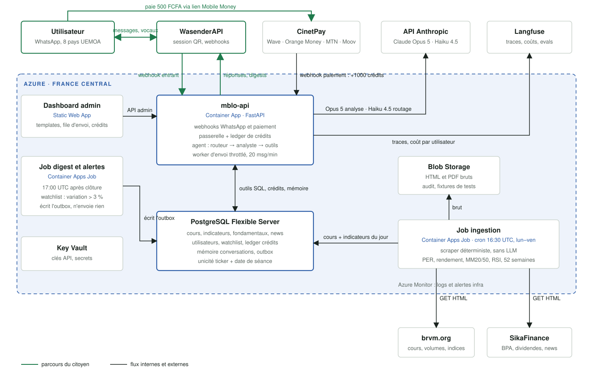
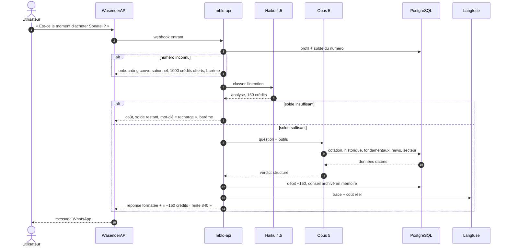
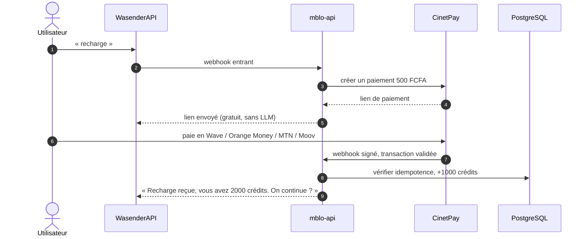
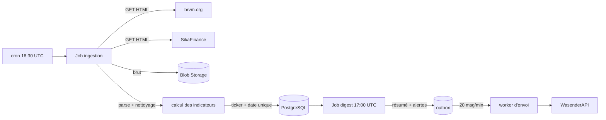

# Mblo

**Ton conseiller BRVM sur WhatsApp.**

Mblo est un agent IA qui fait le travail de recherche à la place des particuliers qui veulent investir à la Bourse Régionale des Valeurs Mobilières (BRVM) mais n'ont ni le temps ni les outils pour analyser les sociétés cotées. L'utilisateur pose sa question sur WhatsApp, l'agent collecte les données du marché, calcule les indicateurs, raisonne, et répond avec un avis argumenté : acheter, conserver, vendre ou attendre, avec les risques et les sources.

Projet construit pour l'[Open Agent Hackathon 2026](https://hackathon.genai.works/event/open-agent-hackathon-2026), track **Real-World Industry Agents**, et conçu pour être déployé réellement dans les 8 pays de l'UEMOA.

---

## Sommaire

1. [Le problème](#le-problème)
2. [Ce que fait Mblo](#ce-que-fait-mblo)
3. [Architecture](#architecture)
4. [Les blocs, un par un](#les-blocs-un-par-un)
5. [Workflows](#workflows)
6. [Modèle économique : les crédits](#modèle-économique--les-crédits)
7. [Stack technique](#stack-technique)
8. [Failure modes connus](#failure-modes-connus)
9. [Feuille de route](#feuille-de-route)
10. [Licence](#licence)

---

## Le problème

La BRVM cote une cinquantaine de sociétés pour huit pays. L'information existe (brvm.org, SikaFinance, bulletins officiels, rapports d'activité) mais elle est dispersée, technique, et personne n'a le temps de la suivre chaque jour. Résultat : les particuliers achètent sur le bouche-à-oreille, ou n'achètent pas.

## Ce que fait Mblo

- **Répond sur WhatsApp**, le canal déjà installé sur chaque téléphone de la zone. Pas d'application à télécharger.
- **Analyse une action** à la demande : cours, tendance, volumes, PER, rendement du dividende, position dans le secteur, actualités récentes. Verdict clair avec niveau de confiance, thèse en trois points, risques, sources datées.
- **Compare plusieurs actions** selon l'objectif de l'utilisateur (revenus passifs, croissance long terme, spéculation).
- **Se souvient** du profil, de la watchlist, des positions et des conseils déjà donnés.
- **Envoie un résumé de clôture** chaque jour de bourse et des alertes sur les mouvements de la watchlist.
- **Se finance par des crédits** rechargeables en Mobile Money, sans carte bancaire.

Mblo est une aide à la décision. Il fait le travail de recherche, présente les chiffres et les risques, et l'utilisateur décide. Il ne passe pas d'ordres et ne remplace pas une Société de Gestion et d'Intermédiation (SGI).

**Le ton** : un français correct mais simple, phrases courtes, chaque terme technique expliqué en quelques mots la première fois. Le jeune qui découvre la bourse et l'investisseur expérimenté doivent tous deux comprendre.

---

## Architecture



Principe directeur : **le LLM ne touche jamais aux données brutes**. L'ingestion est déterministe et sans IA. L'agent raisonne uniquement sur ce qui est en base, via des outils, et chaque chiffre cité dans une réponse provient d'un outil. C'est ce qui rend les réponses vérifiables et évaluables.

---

## Les blocs, un par un

### Canaux et services externes

| Bloc | Rôle |
|---|---|
| **Utilisateur WhatsApp** | Écrit en texte ou en note vocale. Identifié par son numéro, aucun compte à créer. |
| **WasenderAPI** | Passerelle WhatsApp (session liée par QR code). Reçoit les messages et les pousse au webhook de Mblo, envoie les réponses. Encapsulée derrière une interface fournisseur unique pour pouvoir basculer vers l'API officielle Meta sans toucher au reste. |
| **CinetPay** | Agrégateur de paiement Mobile Money (Wave, Orange Money, MTN, Moov). Génère le lien de paiement et notifie Mblo par webhook signé. |
| **API Anthropic** | Claude Haiku 4.5 classe l'intention et fixe le coût en crédits. Claude Opus 5 mène l'analyse avec les outils. |
| **Langfuse** | Observabilité : trace chaque appel LLM, chaque outil, le coût réel par utilisateur et par conversation. Ses datasets servent de base aux evals. |

### Sur Azure

| Bloc | Service | Rôle |
|---|---|---|
| **mblo-api** | Container App (FastAPI) | Le cœur. Reçoit les webhooks WhatsApp et paiement, identifie l'utilisateur, vérifie et débite les crédits, fait tourner l'agent, formate la réponse pour WhatsApp. Héberge aussi le worker d'envoi qui vide l'outbox à cadence limitée (20 messages/minute, délais aléatoires). |
| **Job ingestion** | Container Apps Job, cron 16:30 UTC lun–ven | Scrape brvm.org (cours, volumes, indices) et SikaFinance (BPA, dividendes, actualités) en HTTP simple. Sauvegarde le brut dans Blob, calcule les indicateurs en Python (PER, rendement, moyennes mobiles 20 et 50 jours, RSI, plus haut et plus bas 52 semaines, volume anormal, comparaison sectorielle), insère en base avec unicité ticker + date de séance. |
| **Job digest et alertes** | Container Apps Job, 17:00 UTC | Compose le résumé de clôture pour les abonnés dont le solde le permet et détecte les variations de watchlist supérieures à 3 %. Écrit dans l'outbox seulement, n'envoie jamais directement. Le worker vide l'outbox à 20 messages par minute au total, un seul message par personne, pour ne pas ressembler à du spam. |
| **PostgreSQL Flexible Server** | Base unique | Données de marché historisées, fondamentaux, actualités, profils utilisateurs, watchlist, ledger de crédits, mémoire des conversations, conseils archivés, outbox. |
| **Blob Storage** | Stockage objet | Pages HTML et PDF bruts de chaque ingestion. Sert d'audit et de fixtures pour les tests du scraper. |
| **Dashboard admin** | Static Web App | Templates de digest, file d'envoi et son état, utilisateurs, soldes, recharges, bouton de pause d'urgence des envois. |
| **Key Vault** | Secrets | Clés API Anthropic, WasenderAPI, CinetPay, Langfuse, chaîne de connexion base. |
| **Azure Monitor** | Logs | Logs et alertes infrastructure. |

### L'agent en détail

```
message WhatsApp
   │
   ▼
Routeur (Haiku 4.5) ── intention + coût en crédits
   │
   ├─ mot-clé "recharge" ──────────► lien CinetPay (gratuit, sans LLM)
   ├─ causerie / définition ───────► réponse courte (10 crédits)
   ├─ résumé du jour ──────────────► texte du digest en cache (20 crédits, 1 fois par séance)
   └─ analyse / comparaison ───────► Analyste (Opus 5) + outils (150 / 250 crédits)
                                         │
                                         ├─ cotation(ticker)
                                         ├─ historique(ticker, jours)
                                         ├─ fondamentaux(ticker)
                                         ├─ actualites(ticker, jours)
                                         ├─ secteur(ticker)
                                         ├─ screener(critères)
                                         └─ profil_utilisateur()
```

Sortie structurée de l'analyste : verdict (Acheter, Conserver, Vendre, Attendre), confiance, thèse en trois points, risques, sources datées, puis une ligne de solde (`−150 crédits · reste 840`).

---

## Workflows

### Une question d'analyse



### Une recharge



### L'ingestion quotidienne



---

## Modèle économique : les crédits

Chaque utilisateur dispose d'un solde de crédits. Le prix est fixe par type d'action, indépendant des tokens réels consommés, pour que l'utilisateur sache toujours ce qu'il paie.

| Action | Crédits |
|---|---|
| Question simple, définition, causerie | 10 |
| Analyse d'une action | 150 |
| Comparaison de 2 à 3 actions | 250 |
| Résumé de clôture du jour | 20, une seule fois par séance |
| Mots-clés « recharge », « solde », « résumé oui », « résumé stop » | 0 |

Règles :

- **1000 crédits offerts** à l'inscription, avec le barème envoyé une fois.
- **Recharge : 1000 crédits pour 500 FCFA**, un seul pack. L'utilisateur écrit « recharge » à tout moment, même avec un solde positif. Les crédits s'additionnent et n'expirent pas.
- **Solde insuffisant pour l'action demandée** : Mblo indique le coût, le solde restant, le mot-clé de recharge et le barème. L'utilisateur peut continuer avec des actions moins chères jusqu'à 0.
- **Solde à 0** : message de recharge seul, aucun appel au LLM.
- **Résumé quotidien sur abonnement explicite seulement**. Proposé une fois à l'inscription, activable et désactivable par « résumé oui » et « résumé stop ». À 17:00, seuls les abonnés dont le solde couvre les 20 crédits sont servis. Sinon rien n'est envoyé ni débité, et un rappel de recharge part une seule fois. Un résumé déjà reçu dans la journée est renvoyé gratuitement sur demande.
- **Ledger** : chaque mouvement (bienvenue, débit, recharge) est une ligne datée avec sa référence. Le solde est toujours la somme des lignes. Une notification CinetPay reçue deux fois est ignorée grâce à sa référence de transaction.
- Le barème vit en base et se modifie depuis le dashboard admin.

---

## Stack technique

| Couche | Choix |
|---|---|
| Langage | Python 3.12 |
| API | FastAPI |
| LLM | SDK Anthropic, Claude Opus 5 (analyse) et Claude Haiku 4.5 (routage) |
| Base | PostgreSQL |
| Scraping | requests + BeautifulSoup, aucun navigateur |
| WhatsApp | WasenderAPI derrière une interface fournisseur |
| Paiement | CinetPay |
| Observabilité | Langfuse, Azure Monitor |
| Hébergement | Azure Container Apps, Container Apps Jobs, PostgreSQL Flexible Server, Blob Storage, Key Vault, Static Web Apps. Région France Central. |
| Dashboard | Next.js sur Static Web Apps |

---

## Failure modes connus

Documentés volontairement, car un agent financier qui cache ses limites est dangereux.

| Risque | Réponse |
|---|---|
| WasenderAPI est non officiel, le numéro peut être banni par WhatsApp | Numéro dédié et progressif, opt-in strict, cadence limitée, un seul digest par jour, pause d'urgence dans le dashboard, bascule Meta prévue derrière l'interface fournisseur |
| Le site source change de structure et le scraper casse | Snapshots bruts dans Blob, tests sur fixtures, alerte si le nombre de lignes du jour diffère de la veille |
| Le modèle invente un chiffre ou un ticker | Chaque chiffre vient d'un outil, contrôle automatique que chaque ticker cité existe en base, evals sur un jeu de questions de référence |
| Données fondamentales incomplètes (BPA manquant) | Le verdict le dit explicitement et baisse sa confiance, jamais de PER calculé sur un BPA à 0 |
| Notification de paiement reçue deux fois | Idempotence par référence de transaction |
| Conseil perçu comme un ordre | Formulation en aide à la décision, risques toujours listés, rappel que l'exécution passe par une SGI |

---

## Feuille de route

**Avant le 15 octobre 2026** (aucun code produit, règle du hackathon)

- Compte marchand CinetPay, compte WasenderAPI et numéro dédié, compte Azure.
- Inventaire des sources de données et de leur structure.
- Spec des outils de l'agent et du jeu d'evals.
- Script de la démo vidéo de 3 minutes.

**Fenêtre de build, 15 au 20 octobre 2026**

1. Ingestion + base + indicateurs.
2. Agent, outils, sortie structurée.
3. Passerelle WhatsApp, onboarding, crédits.
4. Paiement CinetPay.
5. Digest, alertes, outbox, worker.
6. Dashboard admin.
7. Evals, doc des failure modes, déploiement Azure, vidéo.

---

## Licence

Voir [LICENSE](LICENSE).
